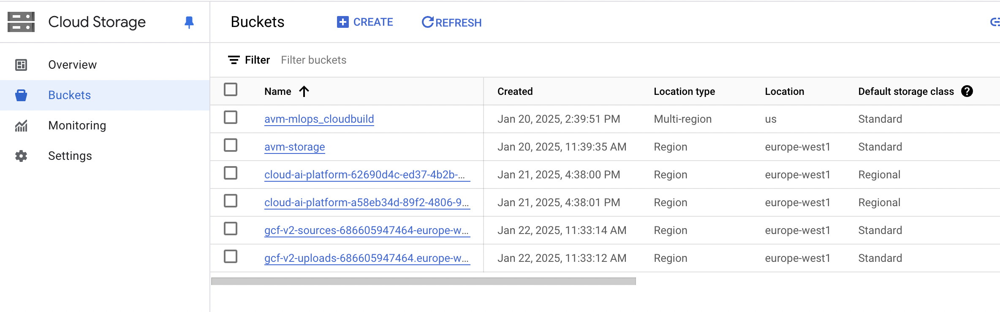
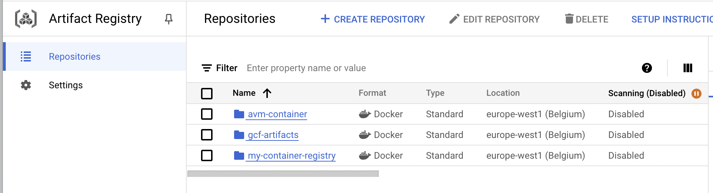
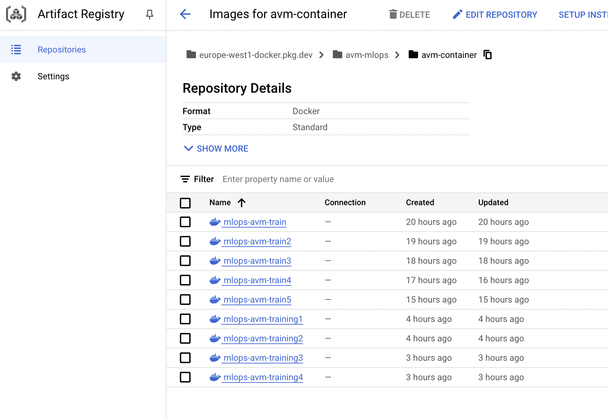
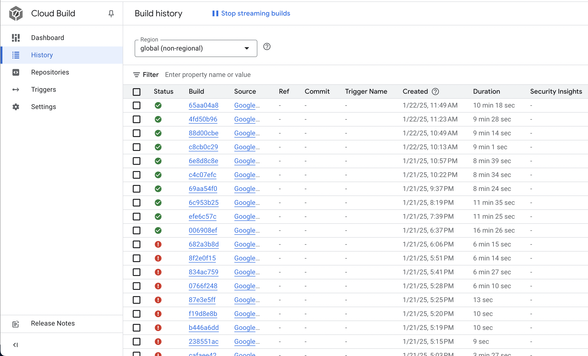

# Exam template for 02476 Machine Learning Operations

This is the report template for the exam. Please only remove the text formatted as with three dashes in front and behind
like:

```--- question 1 fill here ---```

Where you instead should add your answers. Any other changes may have unwanted consequences when your report is
auto-generated at the end of the course. For questions where you are asked to include images, start by adding the image
to the `figures` subfolder (please only use `.png`, `.jpg` or `.jpeg`) and then add the following code in your answer:

```markdown

```

In addition to this markdown file, we also provide the `report.py` script that provides two utility functions:

Running:

```bash
python report.py html
```

Will generate a `.html` page of your report. After the deadline for answering this template, we will auto-scrape
everything in this `reports` folder and then use this utility to generate a `.html` page that will be your serve
as your final hand-in.

Running

```bash
python report.py check
```

Will check your answers in this template against the constraints listed for each question e.g. is your answer too
short, too long, or have you included an image when asked. For both functions to work you mustn't rename anything.
The script has two dependencies that can be installed with

```bash
pip install typer markdown
```

## Overall project checklist

The checklist is *exhaustive* which means that it includes everything that you could do on the project included in the
curriculum in this course. Therefore, we do not expect at all that you have checked all boxes at the end of the project.
The parenthesis at the end indicates what module the bullet point is related to. Please be honest in your answers, we
will check the repositories and the code to verify your answers.

### Week 1

* [x] Create a git repository (M5)
* [x] Make sure that all team members have write access to the GitHub repository (M5)
* [x] Create a dedicated environment for you project to keep track of your packages (M2)
* [x] Create the initial file structure using cookiecutter with an appropriate template (M6)
* [x] Fill out the `data.py` file such that it downloads whatever data you need and preprocesses it (if necessary) (M6)
* [x] Add a model to `model.py` and a training procedure to `train.py` and get that running (M6)
* [x] Remember to fill out the `requirements.txt` and `requirements_dev.txt` file with whatever dependencies that you
    are using (M2+M6)
* [x] Remember to comply with good coding practices (`pep8`) while doing the project (M7)
* [ ] Do a bit of code typing and remember to document essential parts of your code (M7)
* [x] Setup version control for your data or part of your data (M8)
* [x] Add command line interfaces and project commands to your code where it makes sense (M9)
* [x] Construct one or multiple docker files for your code (M10)
* [x] Build the docker files locally and make sure they work as intended (M10)
* [x] Write one or multiple configurations files for your experiments (M11)
* [x] Used Hydra to load the configurations and manage your hyperparameters (M11)
* [ ] Use profiling to optimize your code (M12)
* [ ] Use logging to log important events in your code (M14)
* [x] Use Weights & Biases to log training progress and other important metrics/artifacts in your code (M14)
* [ ] Consider running a hyperparameter optimization sweep (M14)
* [ ] Use PyTorch-lightning (if applicable) to reduce the amount of boilerplate in your code (M15)

### Week 2

* [x] Write unit tests related to the data part of your code (M16)
* [x] Write unit tests related to model construction and or model training (M16)
* [x] Calculate the code coverage (M16)
* [x] Get some continuous integration running on the GitHub repository (M17)
* [x] Add caching and multi-os/python/pytorch testing to your continuous integration (M17)
* [x] Add a linting step to your continuous integration (M17)
* [x] Add pre-commit hooks to your version control setup (M18)
* [ ] Add a continues workflow that triggers when data changes (M19)
* [ ] Add a continues workflow that triggers when changes to the model registry is made (M19)
* [x] Create a data storage in GCP Bucket for your data and link this with your data version control setup (M21)
* [ ] Create a trigger workflow for automatically building your docker images (M21)
* [x] Get your model training in GCP using either the Engine or Vertex AI (M21)
* [x] Create a FastAPI application that can do inference using your model (M22)
* [x] Deploy your model in GCP using either Functions or Run as the backend (M23)
* [ ] Write API tests for your application and setup continues integration for these (M24)
* [x] Load test your application (M24)
* [ ] Create a more specialized ML-deployment API using either ONNX or BentoML, or both (M25)
* [x] Create a frontend for your API (M26)

### Week 3

* [ ] Check how robust your model is towards data drifting (M27)
* [ ] Deploy to the cloud a drift detection API (M27)
* [ ] Instrument your API with a couple of system metrics (M28)
* [ ] Setup cloud monitoring of your instrumented application (M28)
* [ ] Create one or more alert systems in GCP to alert you if your app is not behaving correctly (M28)
* [ ] If applicable, optimize the performance of your data loading using distributed data loading (M29)
* [ ] If applicable, optimize the performance of your training pipeline by using distributed training (M30)
* [ ] Play around with quantization, compilation and pruning for you trained models to increase inference speed (M31)

### Extra

* [x] Write some documentation for your application (M32)
* [x] Publish the documentation to GitHub Pages (M32)
* [x] Revisit your initial project description. Did the project turn out as you wanted?
* [x] Create an architectural diagram over your MLOps pipeline
* [x] Make sure all group members have an understanding about all parts of the project
* [x] Uploaded all your code to GitHub

## Group information

### Question 1
> **Enter the group number you signed up on <learn.inside.dtu.dk>**
>
> Answer:

Group 22

### Question 2
> **Enter the study number for each member in the group**
>
> Example:
>
> *sXXXXXX, sXXXXXX, sXXXXXX*
>
> Answer:

*s214963, s214952, s214968*

### Question 3
> **A requirement to the project is that you include a third-party package not covered in the course. What framework**
> **did you choose to work with and did it help you complete the project?**
>
> Recommended answer length: 100-200 words.
>
> Example:
> *We used the third-party framework ... in our project. We used functionality ... and functionality ... from the*
> *package to do ... and ... in our project*.
>
> Answer:

--- question 3 fill here ---

## Coding environment

> In the following section we are interested in learning more about you local development environment. This includes
> how you managed dependencies, the structure of your code and how you managed code quality.

### Question 4

> **Explain how you managed dependencies in your project? Explain the process a new team member would have to go**
> **through to get an exact copy of your environment.**
>
> Recommended answer length: 100-200 words
>
> Example:
> *We used ... for managing our dependencies. The list of dependencies was auto-generated using ... . To get a*
> *complete copy of our development environment, one would have to run the following commands*
>
> Answer:

We used a requirements.txt file for managing our dependencies. This file lists all the Python packages required for the project along with their specific versions. We added dependencies along the way to ensure all necessary packages were included.

To get an exact copy of our development environment, a new team member would need to follow these steps: Clone the project repository. Navigate to the project directory. Create a virtual environment. Activate the virtual environment. Install the dependencies from the requirements.txt file using pip install -r requirements.txt.

By following these steps, a new team member will have an exact copy of the development environment, ensuring consistency across the team and avoiding potential issues related to missing or incompatible packages.

### Question 5

> **We expect that you initialized your project using the cookiecutter template. Explain the overall structure of your**
> **code. What did you fill out? Did you deviate from the template in some way?**
>
> Recommended answer length: 100-200 words
>
> Example:
> *From the cookiecutter template we have filled out the ... , ... and ... folder. We have removed the ... folder*
> *because we did not use any ... in our project. We have added an ... folder that contains ... for running our*
> *experiments.*
>
> Answer:

We initialized our project using the Cookiecutter MLOps template, which provided a structured skeleton with directories like src, tests, configs, and data. We adapted the template by populating the src folder with the main project logic, including the AVM package that contains the FastAPI implementation (api.py), PyTorch model (model.py), and feature engineering (data.py).

In the tests folder, we added an integrationtests directory specifically for API tests, such as validating the / and /predict endpoints under various scenarios. Additionally, we created a performancetests folder for load testing with Locust, enabling us to assess the API’s performance under high traffic.

We also customized the configs directory to include a cloudbuild.yaml file for seamless CI/CD integration and modified the dockerfiles folder to align with our deployment on Google Cloud Run.

These deviations from the template allowed us to organize our code effectively for robust testing, scalability, and cloud deployment while adhering to MLOps best practices. The overall structure ensures maintainability and efficient testing for future iterations of the project.

### Question 6

> **Did you implement any rules for code quality and format? What about typing and documentation? Additionally,**
> **explain with your own words why these concepts matters in larger projects.**
>
> Recommended answer length: 100-200 words.
>
> Example:
> *We used ... for linting and ... for formatting. We also used ... for typing and ... for documentation. These*
> *concepts are important in larger projects because ... . For example, typing ...*
>
> Answer:

We implemented several rules for code quality, formatting, typing, and documentation. For linting and formatting, we used Ruff, which ensures adherence to Python style conventions, fixes linting violations, and maintains consistent code formatting. For static type checking, we integrated mypy into our workflows, running it in strict mode to catch potential type-related bugs early in development. Documentation is encouraged through pre-commit hooks like check-docstring-first, ensuring functions and classes include docstrings.

These concepts are vital in larger projects because they improve collaboration, maintainability, and scalability. Code quality rules and consistent formatting prevent stylistic disagreements and reduce merge conflicts. Typing helps detect type mismatches and reduces runtime errors, enabling developers to catch bugs before deployment. Proper documentation aids new contributors in understanding the project, reducing onboarding time and ensuring long-term project viability. For example, mypy ensures that all function arguments and return values are used as intended, preventing issues when integrating modules.

## Version control

> In the following section we are interested in how version control was used in your project during development to
> corporate and increase the quality of your code.

### Question 7

> **How many tests did you implement and what are they testing in your code?**
>
> Recommended answer length: 50-100 words.
>
> Example:
> *In total we have implemented X tests. Primarily we are testing ... and ... as these the most critical parts of our*
> *application but also ... .*
>
> Answer:

In total, we have implemented 12 tests across different files. These tests cover critical aspects of our application:

Unit Tests: We have 7 unit tests (test_evaluate.py and test_model.py) to validate model functionality, accuracy calculation, forward passes, loss calculation, edge cases, and model initialization.
Integration Tests: 3 integration tests (integrationtests/test_api.py) ensure the FastAPI endpoints work correctly, including health checks, successful predictions, and error handling for invalid data.
Performance Tests: 2 performance tests (performancetests/locustfile.py) simulate real-world traffic using Locust to evaluate the API's scalability and response times.

These tests ensure the reliability, correctness, and robustness of our application.


### Question 8

> **What is the total code coverage (in percentage) of your code? If your code had a code coverage of 100% (or close**
> **to), would you still trust it to be error free? Explain you reasoning.**
>
> Recommended answer length: 100-200 words.
>
> Example:
> *The total code coverage of code is X%, which includes all our source code. We are far from 100% coverage of our **
> *code and even if we were then...*
>
> Answer:

The total code coverage of our tests is 61%, which covers the majority of our core functionalities. While this demonstrates a significant effort in testing key parts of the application, it also highlights areas that need further testing, particularly edge cases and less frequently used code paths.

Even if our code had 100% coverage, it would not guarantee that the code is error-free. Code coverage measures how much of the code is executed during tests, but it does not evaluate the quality of the tests themselves. For example, tests might not cover edge cases, unexpected input scenarios, or complex interactions between components. Additionally, bugs can arise from issues like incorrect logic, dependencies, or untested third-party libraries, which may not be evident from code coverage alone.

Thus, while achieving higher coverage is a good goal, it is equally important to focus on writing meaningful tests that cover a wide variety of scenarios and validate the correctness of the application under different conditions. High coverage combined with robust testing practices leads to more reliable code.

### Question 9

> **Did you workflow include using branches and pull requests? If yes, explain how. If not, explain how branches and**
> **pull request can help improve version control.**
>
> Recommended answer length: 100-200 words.
>
> Example:
> *We made use of both branches and PRs in our project. In our group, each member had an branch that they worked on in*
> *addition to the main branch. To merge code we ...*
>
> Answer:

Yes, our workflow included using branches and pull requests to manage version control effectively. Each team member worked on separate feature branches based on the main branch to ensure an organized and collaborative development process. This approach allowed us to isolate new features, bug fixes, and experiments without affecting the stable codebase.

Once a feature or fix was completed, a pull request (PR) was created to merge changes into the main branch. PRs provided an opportunity for code review, where other team members could provide feedback, suggest improvements, and catch potential issues before merging. This process helped maintain code quality, enforce best practices, and ensure that new changes were well-tested and documented.

Using branches and PRs improved collaboration by reducing conflicts, enabling parallel development, and maintaining a clean and structured commit history. It also allowed us to revert changes easily if issues were detected after merging. Overall, this workflow played a crucial role in maintaining the stability and reliability of our project.


### Question 10

> **Did you use DVC for managing data in your project? If yes, then how did it improve your project to have version**
> **control of your data. If no, explain a case where it would be beneficial to have version control of your data.**
>
> Recommended answer length: 100-200 words.
>
> Example:
> *We did make use of DVC in the following way: ... . In the end it helped us in ... for controlling ... part of our*
> *pipeline*
>
> Answer:

We did make use of DVC (Data Version Control) in our project by integrating it with a Google Cloud Storage bucket to manage and version our data efficiently. We configured our workflow to pull the data at runtime using DVC within our Docker container instead of during the build process. This approach ensured that our container remained lightweight and avoided unnecessary data storage within the image, allowing us to always work with the latest data without rebuilding the container.

By using DVC in this way, we maintained consistency across different project stages and ensured reproducibility, as team members could easily access specific dataset versions without manual intervention. Additionally, it improved our development and deployment pipeline by separating data dependencies from code dependencies, which streamlined collaboration and made it easier to experiment with various data preprocessing techniques.

Overall, incorporating DVC into our workflow, alongside Docker, improved traceability, reproducibility, and data integrity, ensuring that our models were trained and tested on the correct data versions throughout the project lifecycle.


### Question 11

> **Discuss you continuous integration setup. What kind of continuous integration are you running (unittesting,**
> **linting, etc.)? Do you test multiple operating systems, Python  version etc. Do you make use of caching? Feel free**
> **to insert a link to one of your GitHub actions workflow.**
>
> Recommended answer length: 200-300 words.
>
> Example:
> *We have organized our continuous integration into 3 separate files: one for doing ..., one for running ... testing*
> *and one for running ... . In particular for our ..., we used ... .An example of a triggered workflow can be seen*
> *here: <weblink>*
>
> Answer:

Our continuous integration (CI) setup is structured into two workflows: Code Quality and Unit Tests. The Code Quality workflow focuses on linting and static type checking. It uses Ruff to enforce consistent formatting and detect code quality issues, while mypy checks for type correctness in strict mode to catch potential bugs early. This workflow runs on pushes and pull requests to the main branch, ensuring code quality is validated continuously.

The Unit Tests workflow ensures correctness through testing and code coverage analysis. It is configured to run on a matrix of environments, including two operating systems (ubuntu-latest, macos-latest) and two Python versions (3.11, 3.12). This comprehensive setup guarantees compatibility across multiple platforms. The workflow installs dependencies using pip, executes tests with pytest, and generates coverage reports with coverage.

Both workflows leverage GitHub Actions' caching capabilities to optimize performance. For example, pip dependencies are cached based on the hashes of requirements.txt and requirements-dev.txt, reducing installation times. Test artifacts (like .pytest_cache) are also cached to speed up repeated runs. This ensures that our CI pipeline remains efficient and cost-effective, even as the project scales.

These workflows ensure code quality, maintainability, and reliability by validating style, type safety, and correctness at every stage. By automating these processes, we minimize human error and reduce the overhead of manual checks. You can view an example of the Code Quality workflow [here](https://github.com/ThomasSchiolerH/MLOps-Project/blob/main/.github/workflows/test.yml)

## Running code and tracking experiments

> In the following section we are interested in learning more about the experimental setup for running your code and
> especially the reproducibility of your experiments.

### Question 12

> **How did you configure experiments? Did you make use of config files? Explain with coding examples of how you would**
> **run a experiment.**
>
> Recommended answer length: 50-100 words.
>
> Example:
> *We used a simple argparser, that worked in the following way: Python  my_script.py --lr 1e-3 --batch_size 25*
>
> Answer:

We configured experiments using a YAML file that supports multiple named configurations, making it easy to switch between setups like baseline, large_batch, or high_lr. The script uses argparse to accept --config (name of the desired configuration). <br />
Example command:<br />
```python train.py --config baseline``` <br />
This approach centralizes parameters, ensuring consistent and flexible experimentation.


### Question 13

> **Reproducibility of experiments are important. Related to the last question, how did you secure that no information**
> **is lost when running experiments and that your experiments are reproducible?**
>
> Recommended answer length: 100-200 words.
>
> Example:
> *We made use of config files. Whenever an experiment is run the following happens: ... . To reproduce an experiment*
> *one would have to do ...*
>
> Answer:

We ensured reproducibility by using version-controlled YAML configuration files, where all hyperparameters and dataset paths are clearly defined and structured. Each experiment’s configuration is logged, and its outputs (e.g., trained model weights) are saved with unique identifiers in the filenames (e.g., baseline_model.pth). <br />
To reproduce an experiment: <br />
    1.	Run the script with the same –config argument. <br />
    2.	Ensure the datasets and preprocessing steps remain consistent (logged in the same YAML file). <br />
Additionally, random seeds are set for all experiments to control stochastic processes, ensuring consistent results across runs. These measures ensure no critical details are lost, and experiments are fully reproducible.


### Question 14

> **Upload 1 to 3 screenshots that show the experiments that you have done in W&B (or another experiment tracking**
> **service of your choice). This may include loss graphs, logged images, hyperparameter sweeps etc. You can take**
> **inspiration from [this figure](figures/wandb.png). Explain what metrics you are tracking and why they are**
> **important.**
>
> Recommended answer length: 200-300 words + 1 to 3 screenshots.
>
> Example:
> *As seen in the first image when have tracked ... and ... which both inform us about ... in our experiments.*
> *As seen in the second image we are also tracking ... and ...*
>
> Answer:


As seen in the attached image, we tracked several metrics during our experiments in W&B to understand the behavior and performance of our model across different configurations.
In the first chart, we tracked the progression of epochs for three configurations: high_lr, large_batch, and baseline. This ensures all configurations follow the same number of steps for a fair comparison.
The second chart shows the training loss over epochs for each configuration. This metric is essential as it helps us understand how well the model is fitting the training data. For instance, the high_lr configuration initially had a rapid decline in training loss but plateaued quickly, which suggests it may have reached its convergence limit earlier.
The third chart tracks the validation loss over epochs. This metric is critical as it reflects the model's generalization ability to unseen data. While the large_batch configuration showed smoother validation loss compared to baseline and high_lr, the baseline configuration performed the best in terms of minimizing validation loss, indicating better generalization.
These experiments demonstrate how different hyperparameters affect the training and validation process. W&B’s interactive dashboard allowed us to monitor these metrics in real-time and compare configurations effectively, helping us identify the best-performing setup for our project. This tracking setup makes it easier to fine-tune the model for optimal results.


### Question 15

> **Docker is an important tool for creating containerized applications. Explain how you used docker in your**
> **experiments/project? Include how you would run your docker images and include a link to one of your docker files.**
>
> Recommended answer length: 100-200 words.
>
> Example:
> *For our project we developed several images: one for training, inference and deployment. For example to run the*
> *training docker image: `docker run trainer:latest lr=1e-3 batch_size=64`. Link to docker file: <weblink>*
>
> Answer:

For our project, we developed two Docker images: one for training and one for API/inference deployment.

Training Dockerfile (train.dockerfile):
This image is designed to handle the training process. It integrates DVC for data versioning and pulls the necessary training data. The training script is executed within the container, and the resulting model artifact is uploaded to a Google Cloud Storage bucket for later use. To build and run the training image:
docker build -f train.dockerfile -t trainer:latest .
docker run -v $(pwd):/app trainer:latest.

API/Inference Dockerfile (api.dockerfile):
This image is used to deploy a FastAPI-based inference service. It packages the API code, dependencies, the trained model, and other required artifacts (e.g., a scaler). The container exposes port 8080 for serving predictions. This allows users to send requests for predictions via the FastAPI endpoint or interact with the Gradio interface. To build and run the API image:
docker build -f api.dockerfile -t inference:latest .
docker run -p 8080:8080 inference:latest.

Link to the taining docker file [here](https://github.com/ThomasSchiolerH/MLOps-Project/blob/main/dockerfiles/train.dockerfile)
Link to the api docker file [here](https://github.com/ThomasSchiolerH/MLOps-Project/blob/main/dockerfiles/api.dockerfile)

### Question 16

> **When running into bugs while trying to run your experiments, how did you perform debugging? Additionally, did you**
> **try to profile your code or do you think it is already perfect?**
>
> Recommended answer length: 100-200 words.
>
> Example:
> *Debugging method was dependent on group member. Some just used ... and others used ... . We did a single profiling*
> *run of our main code at some point that showed ...*
>
> Answer:

When we ran into bugs, we used simple methods like adding `print()` statements to check the flow of the code and inspect variable values. This helped us quickly figure out where things went wrong, especially in parts like data preprocessing and the training loop.   <br />
We also used the debugger in PyCharm to step through the code and see exactly what was happening. Breakpoints made it easy to pause and inspect variables, which was super useful for tracking down tricky issues.
For performance, instead of advanced profiling tools, we looked at how long certain steps took by using basic timers like Python’s `time` module. This gave us an idea of which parts of the code were slow and needed improvement, like the data loading process during training.
Overall, these simple techniques were enough to debug and optimize most of the issues we faced.


## Working in the cloud

> In the following section we would like to know more about your experience when developing in the cloud.

### Question 17

> **List all the GCP services that you made use of in your project and shortly explain what each service does?**
>
> Recommended answer length: 50-200 words.
>
> Example:
> *We used the following two services: Engine and Bucket. Engine is used for... and Bucket is used for...*
>
> Answer:

In our project, we utilized several GCP services to streamline the MLOps workflow. Cloud Storage (Bucket) was used to securely store datasets, models, and other artifacts, providing a centralized location for data access across various components. Artifact Registry played a crucial role in storing and managing Docker container images and ML model artifacts. Cloud Build enabled us to automate the build, test, and deployment processes. We leveraged Vertex AI for its end-to-end machine learning capabilities, using it to train and push our models efficiently to a bucket. Cloud Functions provided a serverless environment to execute lightweight tasks. Finally, Cloud Run allowed us to deploy and scale containerized ML inference services with minimal operational overhead, ensuring efficient resource utilization and scalability. Together, these services facilitated a robust, automated, and scalable MLOps pipeline.


### Question 18

> **The backbone of GCP is the Compute engine. Explained how you made use of this service and what type of VMs**
> **you used?**
>
> Recommended answer length: 100-200 words.
>
> Example:
> *We used the compute engine to run our ... . We used instances with the following hardware: ... and we started the*
> *using a custom container: ...*
>
> Answer:

In our project, we did not directly utilize Compute Engine instances; instead, we leveraged Vertex AI, which abstracts the underlying infrastructure and provides managed services for machine learning workloads. Vertex AI internally utilizes Compute Engine to run training jobs, deploy models, and handle inference, but this is managed by GCP, allowing us to focus on model development rather than infrastructure management. Vertex AI automatically provisions the necessary compute resources based on workload requirements, optimizing for performance and cost. While we did not manually select specific VM types, Vertex AI typically uses machine types optimized for ML tasks, such as those with GPUs or TPUs for accelerated training and inference. This approach allowed us to efficiently scale our ML workflows without having to handle VM configuration and management manually.

### Question 19

> **Insert 1-2 images of your GCP bucket, such that we can see what data you have stored in it.**
> **You can take inspiration from [this figure](figures/bucket.png).**
>
> Answer:



### Question 20

> **Upload 1-2 images of your GCP artifact registry, such that we can see the different docker images that you have**
> **stored. You can take inspiration from [this figure](figures/registry.png).**
>
> Answer:




### Question 21

> **Upload 1-2 images of your GCP cloud build history, so we can see the history of the images that have been build in**
> **your project. You can take inspiration from [this figure](figures/build.png).**
>
> Answer:



### Question 22

> **Did you manage to train your model in the cloud using either the Engine or Vertex AI? If yes, explain how you did**
> **it. If not, describe why.**
>
> Recommended answer length: 100-200 words.
>
> Example:
> *We managed to train our model in the cloud using the Engine. We did this by ... . The reason we choose the Engine*
> *was because ...*
>
> Answer:

Yes, we successfully trained our model in the cloud using Vertex AI. We achieved this by first creating a custom training Dockerfile that defined our training environment, including dependencies and the training script. We then wrote configuration files specifying parameters such as resource allocation and training settings. The Docker image was built and pushed to Artifact Registry, allowing Vertex AI to access and use it for model training.

Once the container was available, we created a custom training job on Vertex AI, specifying the image location and necessary configurations for the training process. After completion, the trained model was automatically exported and stored in a Cloud Storage bucket for further evaluation and deployment. We chose Vertex AI because it provides a managed and scalable environment, abstracting infrastructure complexities while offering seamless integration with other GCP services such as Cloud Storage and Artifact Registry. This streamlined our workflow, enabling efficient model training and deployment in the cloud.
## Deployment

### Question 23

> **Did you manage to write an API for your model? If yes, explain how you did it and if you did anything special. If**
> **not, explain how you would do it.**
>
> Recommended answer length: 100-200 words.
>
> Example:
> *We did manage to write an API for our model. We used FastAPI to do this. We did this by ... . We also added ...*
> *to the API to make it more ...*
>
> Answer:

We did manage to write an API for our model, and we chose FastAPI to do it. The main reason for picking FastAPI was its simplicity and built-in features like automatic documentation and validation. We started by creating a Python module that loads our trained model—either from a local file or from a cloud storage location—then initializes FastAPI. We wrote a few endpoint functions: a health-check endpoint that just returns “OK,” and a prediction endpoint that accepts JSON input with the necessary features. Inside the prediction endpoint, we parse and validate the incoming data, apply the same feature-engineering transformations we used at training time, and then pass the processed features to the model’s predict() method. Finally, we return the prediction in JSON format to the user. One extra step we took was to containerize everything with Docker, which ensures our environment remains consistent across development, testing, and production.

### Question 24

> **Did you manage to deploy your API, either in locally or cloud? If not, describe why. If yes, describe how and**
> **preferably how you invoke your deployed service?**
>
> Recommended answer length: 100-200 words.
>
> Example:
> *For deployment we wrapped our model into application using ... . We first tried locally serving the model, which*
> *worked. Afterwards we deployed it in the cloud, using ... . To invoke the service an user would call*
> *`curl -X POST -F "file=@file.json"<weburl>`*
>
> Answer:

For deployment, we first tested locally by running our FastAPI service in a Docker container. This approach allowed us to verify that our endpoints functioned correctly and that all dependencies were properly installed. We then pushed our Docker image to Google Artifact Registry, ensuring the image was compatible with an amd64 architecture. Finally, we deployed the container to Google Cloud Run, which automatically handled scaling, load balancing, and HTTPS. To invoke our deployed service, we simply send an HTTP POST request to the generated Cloud Run URL, adding the path /predict for the prediction endpoint. For example, one can run:

curl -X POST \
  -H "Content-Type: application/json" \
  -d '{"AREA_TINGLYST": 100, "CONSTRUCTION_YEAR": 1990, ...}' \
  https://<cloud-run-service-url>/predict
The service responds with a JSON object containing the model’s prediction. Thanks to Cloud Run’s serverless model, we only pay for the compute resources used when requests arrive.

### Question 25

> **Did you perform any unit testing and load testing of your API? If yes, explain how you did it and what results for**
> **the load testing did you get. If not, explain how you would do it.**
>
> Recommended answer length: 100-200 words.
>
> Example:
> *For unit testing we used ... and for load testing we used ... . The results of the load testing showed that ...*
> *before the service crashed.*
>
> Answer:

For unit testing, we used the pytest framework to verify the functionality of our API endpoints. Key tests included checking the health check (/) endpoint, ensuring that the /predict endpoint returned accurate predictions with valid input, and verifying that appropriate error responses were returned for invalid or missing data. These tests also simulated scenarios such as the model not being loaded to validate the robustness of our API.

For load testing, we used Locust, a Python-based performance testing tool. We simulated a ramp-up of 50 users and scaled to a peak of 10,000 users. During the test, the / endpoint handled 39,338 requests with an average response time of 617 ms, and the /predict endpoint handled 118,008 requests with an average response time of 502 ms. No failures were recorded during the test. The 99th percentile response time for /predict was approximately 4.6 seconds, indicating that the service remained stable under heavy load. These results demonstrate that the API can handle significant traffic without degradation, making it suitable for real-world deployment on platforms like Google Cloud Run.

In the future, we would aim to integrate these tests into our CI/CD pipeline to automatically verify functionality and performance after deployment.

### Question 26

> **Did you manage to implement monitoring of your deployed model? If yes, explain how it works. If not, explain how**
> **monitoring would help the longevity of your application.**
>
> Recommended answer length: 100-200 words.
>
> Example:
> *We did not manage to implement monitoring. We would like to have monitoring implemented such that over time we could*
> *measure ... and ... that would inform us about this ... behaviour of our application.*
>
> Answer:

We did not manage to implement monitoring for our deployed model. However, implementing monitoring would be crucial for ensuring the long-term reliability and performance of our application. Over time, machine learning models can experience data drift, where the input data distribution changes compared to the training data, potentially leading to degraded performance. Monitoring would allow us to detect such issues early and take corrective actions, such as retraining the model with updated data.

In addition to model performance tracking, monitoring would help us measure key metrics such as API response times, error rates, and resource utilization (CPU/memory usage). This type of system monitoring, commonly done using tools like Prometheus and Grafana, would provide insights into application health and allow us to identify bottlenecks or failures proactively.

For ML-specific monitoring, we could use tools such as Evidently AI, which can track metrics like feature drift and concept drift, helping us detect changes in the data over time. By implementing these monitoring practices, we would ensure our model remains effective and reliable, and that we are alerted when performance starts to degrade.

## Overall discussion of project

> In the following section we would like you to think about the general structure of your project.

### Question 27

> **How many credits did you end up using during the project and what service was most expensive? In general what do**
> **you think about working in the cloud?**
>
> Recommended answer length: 100-200 words.
>
> Example:
> *Group member 1 used ..., Group member 2 used ..., in total ... credits was spend during development. The service*
> *costing the most was ... due to ... . Working in the cloud was ...*
>
> Answer:

During our project, we focused more on the operational aspects of MLOps rather than training an advanced model, which led to relatively low cloud credit usage, only around 2 dollars. In total, our group spent minimal credits, as we opted for a simple model that met our project goals. Specifically, the highest cost came from Artifact Registry, likely due to storing and managing our containerized applications. Other services, such as Vertex AI and Compute Engine, incurred some costs.

Overall, working in the cloud provided us with valuable experience in managing resources, deploying models, and automating workflows efficiently. The flexibility and scalability of cloud services were beneficial, and we found the pay-as-you-go model cost-effective for our project needs. Looking forward, we plan to continue this project as a hobby, where we intend to train the model further and utilize more cloud credits to explore advanced AI capabilities.


### Question 28

> **Did you implement anything extra in your project that is not covered by other questions? Maybe you implemented**
> **a frontend for your API, use extra version control features, a drift detection service, a kubernetes cluster etc.**
> **If yes, explain what you did and why.**
>
> Recommended answer length: 0-200 words.
>
> Example:
> *We implemented a frontend for our API. We did this because we wanted to show the user ... . The frontend was*
> *implemented using ...*
>
> Answer:

We implemented a frontend for our API using Gradio. This was done to provide an intuitive and user-friendly interface for interacting with our apartment price prediction model. Instead of requiring users to send JSON payloads through tools like Postman or cURL, the Gradio frontend allows users to input apartment features through a web-based graphical interface, making the model accessible to non-technical stakeholders.

The Gradio interface was integrated directly into our FastAPI application and mounted at the /gradio route. Users can input apartment details such as floor, construction year, area, and more, and receive a nicely formatted output showing the predicted price per square meter and total price in Danish Krone (DKK). This approach simplifies the interaction process while improving usability and accessibility.

The choice of Gradio was driven by its simplicity, rapid implementation, and seamless integration with FastAPI, enabling us to demonstrate the model's capabilities effectively.

### Question 29

> **Include a figure that describes the overall architecture of your system and what services that you make use of.**
> **You can take inspiration from [this figure](figures/overview.png). Additionally, in your own words, explain the**
> **overall steps in figure.**
>
> Recommended answer length: 200-400 words
>
> Example:
>
> *The starting point of the diagram is our local setup, where we integrated ... and ... and ... into our code.*
> *Whenever we commit code and push to GitHub, it auto triggers ... and ... . From there the diagram shows ...*
>
> Answer:

--- question 29 fill here ---

### Question 30

> **Discuss the overall struggles of the project. Where did you spend most time and what did you do to overcome these**
> **challenges?**
>
> Recommended answer length: 200-400 words.
>
> Example:
> *The biggest challenges in the project was using ... tool to do ... . The reason for this was ...*
>
> Answer:

One of the biggest challenges we faced was deploying our model in the cloud using Docker and Google Cloud services, such as Cloud Run and Vertex AI. A significant amount of time was spent configuring Docker files, managing dependencies, and troubleshooting deployment issues. The primary challenge was dealing with credentials and IAM permissions, which required multiple deployment attempts and resulted in long waiting times to identify and fix minor issues.

We initially deployed directly to the cloud to simplify access control, but in hindsight, it would have been more efficient to first set up and test everything locally. Running the API locally with tools like FastAPI and Docker would have allowed us to iterate faster, catch dependency issues earlier, and avoid long cloud build times.

Managing environment variables and credentials was another struggle, leading to deployment failures due to permission issues. We also faced difficulties with cloud resource quotas and correct container configurations. To address this, we carefully configured Google Cloud IAM roles, used environment variable files, and optimized our Docker setup to streamline the deployment process.

To overcome these challenges, we broke the deployment process into smaller steps, prioritized local testing, and used detailed logging to diagnose errors efficiently. By iterating locally before cloud deployment, we reduced the time spent on debugging and improved the overall development workflow, ultimately leading to a more stable deployment process.

### Question 31

> **State the individual contributions of each team member. This is required information from DTU, because we need to**
> **make sure all members contributed actively to the project. Additionally, state if/how you have used generative AI**
> **tools in your project.**
>
> Recommended answer length: 50-300 words.
>
> Example:
> *Student sXXXXXX was in charge of developing of setting up the initial cookie cutter project and developing of the*
> *docker containers for training our applications.*
> *Student sXXXXXX was in charge of training our models in the cloud and deploying them afterwards.*
> *All members contributed to code by...*
> *We have used ChatGPT to help debug our code. Additionally, we used GitHub Copilot to help write some of our code.*
> Answer:

Student s214963 was responsible for setting up and managing the cloud infrastructure, including configuring Docker containers, setting up Google Cloud Storage buckets, integrating DVC for data versioning, and managing the training pipeline in the cloud. Additionally, they handled the API development and deployment aspects to ensure seamless interaction with the trained models.

Student s214968 was in charge of data processing and transformation, ensuring the dataset was cleaned and prepared correctly for training. They also implemented continuous integration (CI) pipelines to automate testing and deployment, developed the machine learning models, contributed to frontend development, and ensured comprehensive test coverage for the system components.

Student s214952 focused on debugging the codebase, ensuring smooth execution and identifying potential issues during development and deployment. They were also responsible for running experiments, tracking results systematically, and maintaining configuration files and logging mechanisms to improve reproducibility and traceability of the model training process.

Use of Generative AI:
We have utilized ChatGPT to assist with debugging and resolving code issues, providing insights into error messages and suggesting optimization techniques. Additionally, we leveraged GitHub Copilot to help accelerate code writing, especially for repetitive tasks such as writing configuration files, API endpoints, and unit tests. These AI tools significantly improved our productivity by offering coding suggestions and explanations, allowing us to focus more on refining our models and infrastructure.